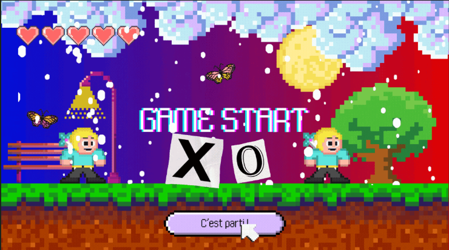

  

<h1 align="center"> Projet Jeu – Tic Tac Toe</h1>

---

##  Présentation du projet
Ce projet consiste en la réalisation du jeu Tic Tac Toe (Morpion)
dans le cadre d’un projet universitaire.
Il permet à deux joueurs de s’affronter à tour de rôle
dans une interface simple et interactive.

---

##  Objectifs du projet
- Mettre en pratique la programmation en langage C  
- Comprendre la logique des jeux  
- Gérer les entrées utilisateurs  
- Développer un programme structuré  
- Améliorer les compétences en algorithmique  

---

##  Fonctionnalités principales
- Mode deux joueurs  
- Interface simple en console  
- Vérification automatique du gagnant  
- Gestion des égalités  
- Redémarrage de partie  

---

##  Aperçu du jeu

  

---

##  Technologies utilisées
- Langage C  
- Code::Blocks  
- Programmation procédurale  

---

##  Contenu du repository
- `main.c` : code source du jeu  
- `TIC TAC TOE.cbp` : projet Code::Blocks  
- `Presentation.pptx` : support de présentation  
- `Jeux vidéo présentation pixel coloré animé.gif` : animation du projet  
- `images/jeu.png` : capture du jeu  

---

##  Exécution du projet
Ouvrir le fichier `TIC TAC TOE.cbp` avec Code::Blocks
puis compiler et exécuter le programme.

---

